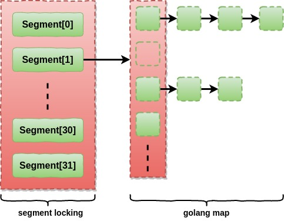

# photon-dance-concurrent-hashmap



## Usage

```golang
import (
    ...
    "github.com/amazingchow/photon-dance-concurrent-hashmap"
    ...
)

...

cm := NewConMap()
cm.Store("Bob", 15)
...
```

## Benchmark

```text
---------------------------------------------------------------------------------
Item                                              Iter               TPS 
---------------------------------------------------------------------------------
BenchmarkConMapThroughputBatch_1-12               100000               695 ns/op
BenchmarkGolangMapThroughputBatch_1-12            100000               610 ns/op
BenchmarkConMapThroughputBatch_16-12              100000              7865 ns/op
BenchmarkGolangMapThroughputBatch_16-12           100000              9418 ns/op
BenchmarkConMapThroughputBatch_32-12              100000             14318 ns/op
BenchmarkGolangMapThroughputBatch_32-12           100000             19169 ns/op
BenchmarkConMapThroughputBatch_64-12              100000             24099 ns/op
BenchmarkGolangMapThroughputBatch_64-12           100000             40984 ns/op
BenchmarkConMapThroughputBatch_128-12             100000             40638 ns/op
BenchmarkGolangMapThroughputBatch_128-12          100000             92595 ns/op
---------------------------------------------------------------------------------
```

## Documentation

### Reference

* [How ConcurrentHashMap Works Internally in Java, by Arun Pandey](https://dzone.com/articles/how-concurrenthashmap-works-internally-in-java)

## Contributing

### Step 1

* 🍴 Fork this repo!

### Step 2

* 🔨 HACK AWAY!

### Step 3

* 🔃 Create a new PR using https://github.com/amazingchow/photon-dance-concurrent-hashmap/compare!

## Support

* Reach out to me at <jianzhou42@163.com>.

## License

* This project is licensed under the MIT License - see the **[MIT license](http://opensource.org/licenses/mit-license.php)** for details.
